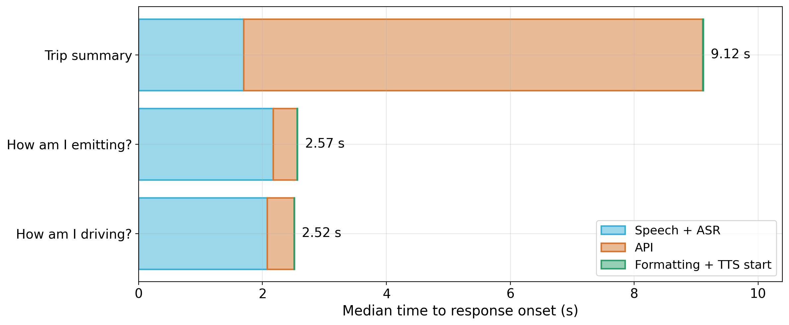
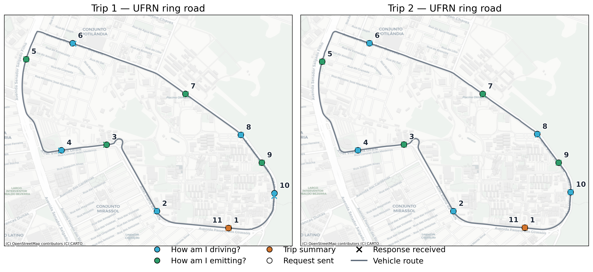

<p align="center">
  
</p>


# Edge AI Smart Glasses Interface for Driver Experience

### Authors: [Alice Freire](https://github.com/alicefvictorino), [Morsinaldo Medeiros](https://github.com/Morsinaldo), [Erick Justino](https://github.com/erickjustino), [Hilton Machado](https://github.com/HiltonThallyson), [Marianne Silva](https://github.com/MarianneDiniz) and [Ivanovitch Silva](https://github.com/ivanovitchm)

## Abstract

The growing integration of sensing, communication, and computing capabilities is transforming connected vehicles into mobile IoT platforms that continuously generate information about vehicle operation and driving conditions. While these data enable intelligent, context-aware services, delivering timely access to such information through hands-free, eyes-free interaction remains a challenge. This work presents a wearable–mobile IoT architecture that uses smart glasses as a hands-free interface to vehicle-generated information. The system integrates Ray-Ban Meta smart glasses, smartphone-based processing, OBD-II vehicular sensing, and platform services, enabling voice interaction concurrently with continuous telemetry acquisition and transmission. The architecture was evaluated under real-world driving conditions through 22 voice interactions involving driving-behavior, emission, and trip-summary queries. For queries performed during driving, median Time to First Audio (TTFA) was 440 ms for driving-behavior feedback and 390 ms for emission information. Smart-glass interactions introduced approximately 24.1 KiB of additional traffic, corresponding to about 5% of the vehicular telemetry volume, while the mobile application required approximately 29 MB of memory and a median CPU utilization of 0.7% of one core. The results provide experimental evidence of the feasibility of smart glasses as a responsive and lightweight human–IoT interface for real-time access to connected-vehicle information.

**Index Terms** — Smart Glasses, IoT, Edge Computing, Connected Vehicles, Wearable Computing, Human–IoT Interaction.

## Overview

Glasses2Car turns commercial smart glasses into a hands-free voice interface to the Conect2AI vehicular platform. The driver speaks a wake phrase followed by a question; the response is synthesized back through the glasses' speakers:

| Question (EN) | Pergunta (PT-BR) | Platform endpoint |
|---|---|---|
| *"Hey Conecta, how am I driving?"* | *"ei Conecta, como estou dirigindo?"* | `/v1/smart-glass/driver-behavior/` (last 120 s) |
| *"Hey Conecta, how am I emitting?"* | *"ei Conecta, como estou emitindo?"* | `/v1/smart-glass/emissions/` (accumulated CO₂) |
| *"Hey Conecta, trip summary"* | *"ei Conecta, resumo da viagem"* | `/v1/smart-glass/trip/summary` (aggregate + finalize) |


Key design points:

- **Wake word on the smartphone.** The glasses' embedded wake-word engine is restricted to the vendor assistant, so Glasses2Car continuously streams the glasses' microphone over Bluetooth HFP and detects *"Hey Conecta"* on the phone (Apple `SFSpeechRecognizer`, pt-BR and en-US).
- **Deterministic response generation.** Structured API responses are converted to natural language by rule/template-based generation — no generative language model, no hallucinated numbers, negligible latency (~0.5 ms).
- **Fully instrumented pipeline.** Every interaction is logged to a local CSV (per-stage timings, GPS position at request/response, exchanged bytes, CPU/memory/battery/thermal state, raw API payload) to support the experimental evaluation.
- **Mock-first development.** The entire glasses integration is developed and tested against Meta's Mock Device Kit, so the test suite runs on a simulator with no physical hardware.

## Repository Layout

```text
.
├── App/                     # SwiftUI application (Glasses2Car)
├── Conect2AICore/           # Swift package: API client, intent parser, bilingual
│                            #   formatters, and its deterministic unit tests
├── Tests/                   # Mock Device Kit XCTests (pairing, camera, lens UI)
├── analysis/                # Field-study notebook, article figures, interactive map
├── data/                    # The two driving sessions (see Data Organization)
├── docs/                    # Step-by-step reproduction manual (in Portuguese)
├── figures/                 # README assets
├── project.yml              # XcodeGen project definition
├── Makefile                 # test-core / test-ios / project targets
├── Local.xcconfig.example   # Per-developer credentials template (see Setup)
└── LICENSE
```

### Data Organization

- `data/smartglass_metrics_trip{1,2}.csv` — one row per voice interaction logged by the app: stage timestamps (wake, command, request, response, TTS), latencies, GPS at send/receive, estimated request and measured response sizes, smartphone CPU/memory/battery/thermal state, glasses thermal state, spoken text, and the raw API payload for full traceability
- `data/telemetry_trip{1,2}.csv` — the App2Car vehicular telemetry (~1 Hz) collected concurrently during the same sessions: position, speed, RPM, engine signals
- `analysis/analise_smartglass.ipynb` — the executed analysis notebook behind the paper: request-location maps over the route, per-stage latency breakdown, TTFA distributions, packet sizes, resource usage, and latency vs. vehicle speed. Notebook prose is in Portuguese; all figures are in English
- `analysis/*.png|.svg|.pdf` — the article figures, regenerated by the notebook

## Requirements

| Component | Requirement |
|---|---|
| macOS host | Xcode 16+ with the iOS platform installed, [XcodeGen](https://github.com/yonaskolb/XcodeGen) (`brew install xcodegen`) |
| iPhone | iOS 16+, Developer Mode enabled |
| Smart glasses | Ray-Ban Meta, firmware v125+, paired with the Meta AI app (v272+) with Developer Mode enabled |
| Meta account | App registered at the [Wearables Developer Center](https://wearables.developer.meta.com) |
| Analysis | Python 3.11+ with `pandas`, `numpy`, `matplotlib`, `folium`, `jupyter` |

## Setup

### 1. Clone the repository

```bash
git clone https://github.com/conect2ai/WPMC-2026-Glasses2Car.git
cd REPO-NAME
```

### 2. Configure per-developer credentials

```bash
cp Local.xcconfig.example Local.xcconfig
```

Fill in `DEVELOPMENT_TEAM` (your Apple Team ID, shown in Xcode → Signing) and `META_APP_ID` / `CLIENT_TOKEN` (from your app registration in the Wearables Developer Center). `Local.xcconfig` is gitignored — never commit it.

When registering the app in the Wearables Developer Center, use a bundle identifier **without hyphens** (the platform rejects them; the reference identifier is `br.ufrn.conect2ai.RayBanTripApp`) and enable the *Camera access* permission. See `docs/MANUAL_REPRODUCAO.md` for a click-by-click walkthrough, including Meta AI Developer Mode and firmware checks.

### 3. Generate the Xcode project

```bash
xcodegen generate
open RayBanTripApp.xcodeproj
```

### 4. Run the test suite (no hardware required)

```bash
make test-core   # Swift package: API client, intents, formatters (24 tests)
make test-ios    # Simulator: Mock Device Kit pairing/camera + lens UI (5 tests)
```

The Mock Device Kit simulates the entire glasses stack (pairing, permissions, camera), so `make test-ios` exercises the real SDK with no physical device.

### 5. Run on the iPhone

Select your iPhone as the destination in Xcode and Run. On first use: enable Developer Mode on the phone when prompted, then in the app tap **Register with Meta AI** (a one-time deep-link confirmation through the Meta AI app), log into the platform, and the *"Hey Conecta"* listener starts automatically after login. The EN ⇄ PT-BR toggle switches the interface, recognizer, generated text, and synthesized voice.

With a free Apple developer account, the installed app expires after 7 days and must be reinstalled from Xcode.

## Reproducing the Analysis

```bash
python3 -m venv .venv && source .venv/bin/activate
pip install pandas numpy matplotlib folium jupyter
jupyter notebook analysis/analise_smartglass.ipynb
```

The notebook is fully deterministic given `data/`: it reconstructs request positions from the telemetry (the paper documents why), regenerates every figure used in the manuscript, and prints the median [IQR] latency table exactly as reported.

## Results

All results below are computed by `analysis/smartglass_analysis.ipynb` from the raw data in `data/` — re-running the notebook regenerates every figure and number. In total, **22 voice interactions** were analyzed (12 driving-behavior, 8 emission, and 2 trip-summary queries), all successfully answered through the glasses while App2Car streamed telemetry in parallel.

### Latency

Latency per request type, as median [interquartile range]; the two trip-summary requests are reported individually due to the small sample:

| Request | n | ASR (ms) | API (ms) | TTFA (ms) |
|---|---|---|---|---|
| How am I driving? | 12 | 2077 [2030–2242] | 434 [394–471] | 440 [399–478] |
| How am I emitting? | 8 | 2173 [2141–2370] | 385 [362–528] | 390 [371–536] |
| Trip summary | 2 | 1689 / 1704 | 6508 / 8317 | 6514 / 8327 |

Once the spoken command is recognized, the answer starts sounding in **under half a second** (median Time to First Audio of 440 ms and 390 ms) for the two queries intended for use while driving. The stage breakdown below shows that, after command recognition, the API round trip accounts for most of that wait — text formatting and TTS initialization are negligible — and that the trip-summary latency is dominated by its broader server-side scope (session aggregation and trip finalization):

<p align="center">
  
</p>

A single outlier API event (~3.8 s, *How am I driving?*) was observed, an order of magnitude above that query's IQR — the reason medians and IQRs are reported instead of means.

### Interactions along the route

The 22 requests were issued while the vehicle was in motion around the UFRN ring road, with positions reconstructed from the concurrent vehicle telemetry (● = request sent, ✕ = response received; browsable versions in `analysis/interactive_map_trip{1,2}.html`):

<p align="center">
  
</p>

### Communication and resource overhead

- **Traffic:** ~16.1 KiB of estimated outgoing traffic and 8.0 KiB of measured response payloads across all 22 requests — **≈5%** of the ~475 KiB (1312 samples, ~371 B/sample) transmitted in parallel by the App2Car telemetry stream during the same sessions;
- **Smartphone footprint (process-scoped, Glasses2Car only):** median CPU of **0.7% of one core** (range 0.4–1.4%; ≈0.1% of the A18 Pro's six-core aggregate) and a stable **≈29 MB** memory footprint (28.7–29.1 MB across both sessions, no growth over time);
- **Device-wide indicators:** the iPhone remained in the *nominal* thermal state throughout, and the battery level stayed at 100% during both ~10-minute sessions (device not connected to power) — no drain observable at the 1% resolution reported by iOS;
- The Meta Wearables Device Access Toolkit exposes no CPU/memory/battery measurements for the glasses themselves; only their thermal state is available (no thermal buildup was observed).

## License

This project is released under the MIT License. See `LICENSE` for details.

## About Conect2AI

[Conect2AI](http://conect2ai.dca.ufrn.br) is a research group at the Federal
University of Rio Grande do Norte (UFRN) focused on applied artificial
intelligence in embedded systems, connected mobility, and related domains.
